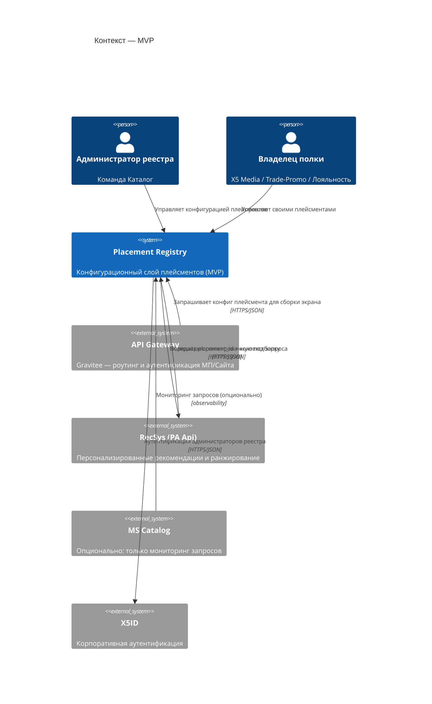
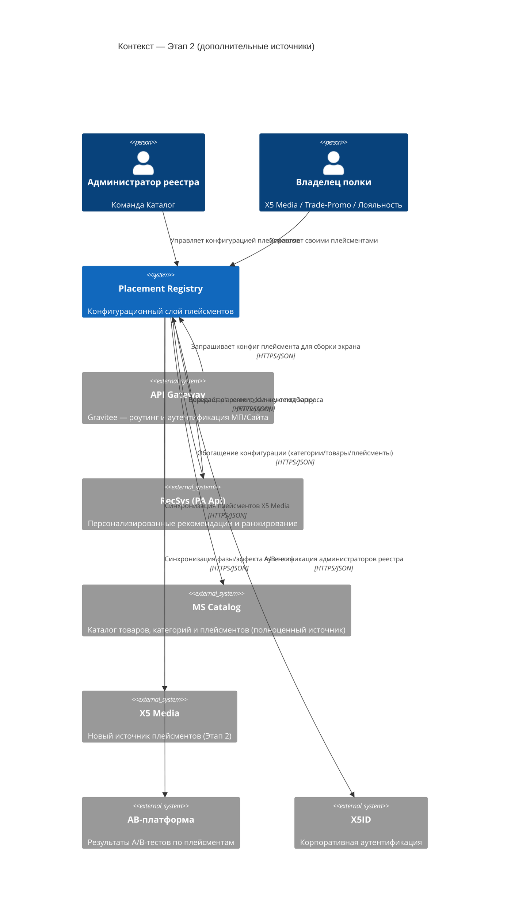
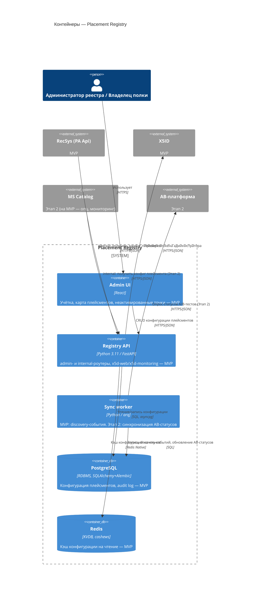

# Реестр плейсментов товарных подборок — архитектура (v0.3)

> Обновлено: 2026-06-25. Версия от 2026-05-19 строилась на предположении о стеке Go/Echo —
> после изучения эталонного сервиса **MS Catalog** (`MS Catalog reference/`) стек пересмотрен
> под фактический корпоративный Python/FastAPI-стек X5.

## 1. Назначение

Реестр плейсментов — конфигурационный слой для управления ~25+ товарными плейсментами на
~18 экранах мобильного приложения ТС5. Сейчас учёт распределён между владельцами
(Каталог, X5 Media, Trade-Promo, Лояльность, RecSys), часть полок не персонализирована,
RecSys используется нецелевым образом.

Эволюция сервиса по интеграциям и зоне ответственности:

1. **MVP** — учётка плейсментов: реестр, просмотр конфигурации, карта полок,
   обнаружение неактивированных точек, ролевая модель. Из внешних источников — **только
   RecSys** (получение рекомендаций по `placement_id` + контекст). Интеграция с Catalog на
   этом этапе не обязательна, максимум — мониторинг запросов от Catalog (наблюдаемость, без
   полноценного обмена данными).
2. **Этап 2 — дополнительные источники** — подключаются **X5 Media** и **плейсменты Caталога**
   как полноценные источники конфигурации (а не просто мониторинг), плюс синхронизация
   `ab_status` с AB-платформой. Реестр становится источником истины для конфигурации плейсмента
   (source, ranking_type, fallback), которую читают потребители при сборке выдачи.
3. **Перспектива (не детализируем сейчас)** — возможна передача в реестр управления
   приоритетами и кросс-полочными правилами, то есть превращение в оркестратор (по аналогии с
   Google Ad Manager / LaunchDarkly targeting). Прорабатывается отдельно, когда появятся
   первые рабочие интеграции по Этапу 2.

Разделение ответственности уже на MVP: **реестр плейсментов управляет источниками и
конфигурацией**, **RecSys отвечает за ранжирование и блендинг** — реестру передаётся только
`placement_id` + контекст запроса, а не сами товарные данные.

## 2. Технологический стек

Стек выровнен с эталонным сервисом MS Catalog, чтобы переиспользовать корпоративную
инфраструктуру и не вводить для платформы новый язык/раннер. Колонка **Этап** показывает,
что нужно поднимать сразу для MVP, а что подключается позже — см. фазировку в §1 и §5.

| Слой | Технология | Этап | Комментарий |
|---|---|---|---|
| Язык/фреймворк | Python 3.11, FastAPI + uvicorn | MVP | `ORJSONResponse` по умолчанию, Pydantic v2 |
| БД | PostgreSQL (в проде у Catalog — Citus) | MVP | через `x5d-db`, миграции — Alembic |
| ORM | SQLAlchemy 2.0 (async) + asyncpg | MVP | репозитории — тонкий слой над SQLAlchemy |
| Кэш | Redis + `cashews` | MVP | кэш конфигурации плейсментов на чтение |
| Очереди/фон. задачи | `arq` (Redis-backed) | MVP | discovery-события (карта полок/неактивированные точки) — нужны уже на MVP |
| Клиент RecSys | `x5d_web.clients.v1.recommendations` | MVP | единственная обязательная внешняя интеграция MVP |
| Аутентификация | X5ID (через `x5d-web` `X5IdClient`) + request signing middleware | MVP | инфраструктурное, не зависит от фазы источников; роли — Администратор реестра / Владелец полки |
| Observability | `x5d-monitoring` (логирование, APM, Prometheus), health-checks из `x5d-web` | MVP | в т.ч. мониторинг запросов от Catalog, если решим делать его уже на MVP |
| Контракты API | OpenAPI (FastAPI автогенерация) + `schemathesis` для контрактных тестов | MVP | |
| Сборка | Docker, корп. базовый образ `docker-5dl-prod.x5.ru/infra/base_image/python:3.11-slim-rc` | MVP | публикация в корп. registry |
| Фронтенд (админка реестра) | React | MVP | отдельный SPA, обращается к `admin`-API (см. §3) |
| CI/lint | `isort` + `black` + `flake8`, корп. образ `python_code_toolkit` | MVP | покрытие тестами ≥ 87% (порог как у MS Catalog) — целевой ориентир для реестра |
| Клиент Catalog | по аналогии с `OMSClientSettings`/`OmniSearchClientSettings` | Этап 2 | полноценный источник конфигурации (категории/товары), не только мониторинг |
| Клиент X5 Media | новый HTTP-клиент (готового в MS Catalog нет) | Этап 2 | новый источник плейсментов |
| Клиент AB-платформы | синхронизация `ab_status` через `arq`-воркер | Этап 2 | без Kafka — по расписанию/триггеру |
| Брокер событий | Kafka (`aiokafka` / Faust-консьюмеры) | Этап 2 | event-driven инвалидация кэша и discovery в реальном времени (см. §6) |
| Управление приоритетами/правилами | не определено | Перспектива | оркестратор-функциональность, не прорабатываем сейчас (см. §1, п.3) |

**Не подтверждено и требует уточнения:** шаблон `.gitlab-ci.yml`, Helm-чарты/k8s-манифесты —
в локальной копии MS Catalog отсутствуют, нужно получить у DevOps/платформенной команды
(см. §9).

## 3. Структура сервиса

Слоистая архитектура — повтор паттерна MS Catalog:

```
routers/          # HTTP-слой: admin / internal / public / (widgets — не нужен реестру)
  admin/           — CRUD конфигурации плейсментов, ролевой доступ, аудит-лог
  internal/        — выдача конфига плейсмента для RecSys/Catalog (service-to-service)
  public/          — health checks, версия API
services/         # бизнес-логика, интерфейсы, схемы запросов/ответов
domain_services/  # доменные правила (валидация конфигурации, переходы статусов, discovery)
repositories/      # доступ к Postgres (конфигурация, аудит) и Redis (кэш)
db/uow.py          # Unit of Work — транзакционные границы
tasks/             # arq-воркеры: фоновая синхронизация источников, обработка discovery-событий
settings/           # pydantic-settings, по образцу MS Catalog (env_prefix на каждый блок настроек)
cli/                # typer-CLI для админ-операций (миграции, ручная синхронизация)
```

API сегментировано по аудитории, как в MS Catalog (`admin/internal/public/widgets`):
у реестра плейсментов нужны как минимум `admin` (UI реестра) и `internal` (чтение конфигурации
другими сервисами); `widgets`-сегмент, специфичный для Catalog, реестру не нужен.

## 4. Доменная модель (по материалам прототипа)

Ключевая сущность — **Placement**:

| Поле | Назначение |
|---|---|
| `id` (placement_id) | устойчивый ключ вида `home.recsys.foryou` |
| `title`, `screen` | отображаемое имя и экран МП |
| `owner` | владелец полки: Каталог / X5 Media / Trade-Promo / Лояльность |
| `source` | источник выдачи: `recsys` / `pbase` / `catalog` / `customer` |
| `formation_type`, `ranking_type` | способ формирования и ранжирования (ml / rule-based / manual) |
| `personalization`, `context_type` | признак персонализации и тип контекста |
| `limit`, `fallback_type` | лимит товаров и фоллбэк-стратегия при недоступности источника |
| `status` | `active` / `draft` |
| `ab_status` | фаза A/B-теста и бизнес-эффект (`delta_margin`, `delta_items`) |
| `metrics` | runtime-метрики: rps, p95, error_rate |
| `business` | бизнес-метрики: РТО, маржа, CTR |

Сопутствующие сущности: **DiscoveryEvent** (автообнаружение нового `placement_id` в трафике МП,
статусы `pending` → `synced`), **AuditLog** (история изменений конфигурации).

## 5. Интеграции

### MVP

- **RecSys** — единственная обязательная внешняя интеграция. У MS Catalog уже есть готовый
  клиент `x5d_web.clients.v1.recommendations` (и `recommendations_logs`) — переиспользовать
  вместо написания нового HTTP-клиента. Реестр передаёт `placement_id` + контекст запроса,
  получает ранжированную подборку.
- **Catalog (опционально)** — на MVP не делаем полноценную интеграцию, максимум — мониторинг
  запросов от Catalog (наблюдаемость через `x5d-monitoring`), без обмена конфигурацией.
- **User-сегменты** — `x5d_web.middleware.user_segments` уже используется в Catalog,
  можно переиспользовать для таргетинга плейсментов по сегменту пользователя (инфраструктурное,
  доступно сразу).

### Этап 2 — дополнительные источники

- **Catalog (полноценно)** — сервис уже содержит клиентские настройки на смежные системы
  (`OMSClientSettings`, `OmniSearchClientSettings`, `OfferHubSettings` и т.д.) — по аналогии
  у реестра появляется клиент к Catalog для синхронизации справочника товаров/категорий и
  плейсментов Каталога как полноценного источника конфигурации.
- **X5 Media** — новый источник плейсментов; готового корпоративного клиента нет, нужен новый
  HTTP-клиент.
- **AB-платформа** — источник `ab_status`; синхронизация по расписанию (`arq`-воркер), без
  Kafka.

### Перспектива (не прорабатываем сейчас)

- Возможная передача в реестр управления приоритетами и кросс-полочными правилами по всем
  подключённым источникам — см. §1, п. 3.

## 6. Брокер событий (Этап 2): Kafka

На MVP Kafka не подключаем — единственная интеграция (RecSys) синхронная HTTP, а discovery-
события на MVP обрабатываются через `arq`-воркеры по расписанию/триггеру. Kafka подключается
на Этапе 2, когда появятся реальные event-driven сценарии:
- событие "конфигурация плейсмента изменилась" → инвалидация кэша у потребителей (RecSys/Catalog/X5 Media);
- событие "обнаружен новый placement_id" в реальном времени, а не батчем.

В этот момент имеет смысл повторить паттерн MS Catalog: `aiokafka`-продьюсеры
(`app/kafka/producers.py`) + Faust-консьюмеры как отдельные сервисы в `docker-compose`.

## 7. Auth и роли

- Аутентификация — X5ID через `x5d-web` (`X5IdClient`, request signing middleware), без
  собственной реализации auth.
- Роли (бизнес-уровень, поверх X5ID): **Администратор реестра** (команда Каталог — полный
  доступ к конфигурации) и **Владелец полки** (Media/Trade-Promo/Лояльность — доступ к своим
  плейсментам, без права менять чужие).

## 8. C4-диаграммы

Построены на основе изучения корпоративной C2-схемы «AS IS» единого мобильного приложения
(`arch-examples/[ARCH][ЕМП] AS IS (1)-C2 AS IS.drawio.png`). Нотация и блоки реальных систем
(Catalog, RecSys, X5ID, API Gateway) взяты оттуда. Сознательно сужено до контура,
непосредственно касающегося реестра: легаси-сервисы вне зоны интеграции (Cita, Widget Config,
корзина/Orders) на схему не включены — см. примечание ниже. Диаграммы — в Mermaid C4, чтобы
рендерились прямо в GitHub/GitLab без дополнительных инструментов; при переносе в корпоративный
стандарт (drawio, C2/C3) — пересобрать по тому же содержанию в принятой нотации (прямоугольники
`Имя [Тип: технология]`, цилиндры БД, пунктирная граница внешних клиентов).

> **Что не включено и почему:** *Cita* — легаси-сервис корзины, полностью заменён на CCS
> (корзина) + Orders/Ordering, в контур реестра плейсментов не входит. *Widget Config* —
> легаси-сервис BDUI (DivKit), уже не используется; актуальная реализация — отдельный сервис
> **LEGO BDUI** для виджетов мобильного приложения, также вне зоны интеграции реестра. Оба
> сервиса исключены из диаграмм и из открытых вопросов.

### 8.1 Контекст — MVP

Только обязательная интеграция (RecSys) + инфраструктурные системы. Catalog показан как
опциональный источник мониторинга (пунктирная связь по смыслу, без обмена конфигурацией).



### 8.2 Контекст — целевая картина (Этап 2)

Добавляются X5 Media и Catalog как полноценные источники конфигурации, плюс синхронизация
с AB-платформой.



### 8.3 Контейнеры (Container) сервиса Placement Registry



## 9. Открытые вопросы / что нужно дозаполнить

1. **C4-диаграммы** — готовы Context (MVP §8.1, Этап 2 §8.2) и Container (§8.3) на основе
   реальной AS-IS схемы, сужены до контура реестра (легаси Cita и Widget Config исключены);
   при переносе в GitLab пересобрать в принятой в компании нотации (drawio/C2), если требуется
   единый формат с остальными арх. документами.
2. **CI/CD и деплой** — нет образца `.gitlab-ci.yml` и k8s-манифестов/Helm-чартов в локальной
   копии MS Catalog; нужно запросить у платформенной команды или найти в каталоге сервисов.
3. **Архитектурное согласование** — формат прохождения арх. комитета для нового сервиса не
   уточнён (см. п. "подготовка" в плане пользователя).
4. **Оценка backend** — для неё нужен зафиксированный API-контракт (`admin`/`internal`
   эндпоинты) и схема Postgres — появятся после детализации доменной модели в §4.
