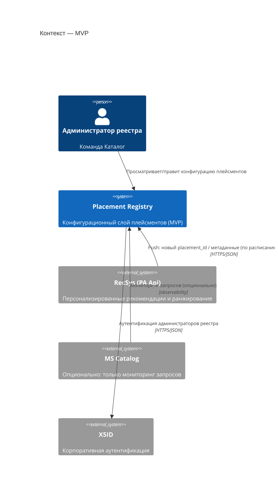
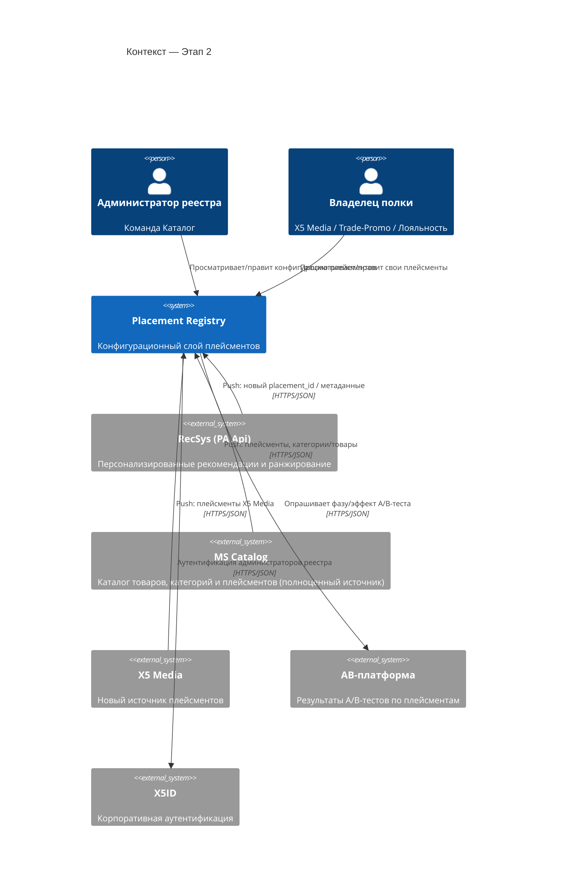
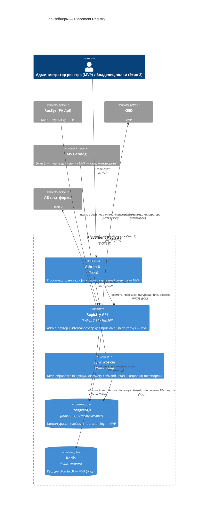

# Реестр плейсментов товарных подборок — архитектура (v0.1)

## 1. Назначение

Реестр плейсментов товарных подборок — сервис для учета (в перспективе - управления) товарными плейсментами на
экранах мобильного приложения ТС5. Сейчас управление распределёно между разными владельцами, нет понимания об их управлении, нет учета,
часть полок не персонализирована.

Эволюция сервиса (этапность сквозная — повторяется в стеке §2 и интеграциях §5):

1. **MVP** — учётка плейсментов RecSys: реестр, просмотр конфигурации, карта полок. Из внешних
   источников — только RecSys, и интеграция **входящая**: RecSys сам по расписанию/триггеру
   (например, появился новый `placement_id`) присылает данные о своих плейсментах в реестр.
   Реестр на MVP ничего не отдаёт наружу — он получатель, а не источник для других сервисов.
   Catalog не интегрируем, максимум — мониторинг запросов от него.
2. **Этап 2 — подключение новых источников информации о товарных полках** — интеграция с
   Каталогом (плейсменты как полноценный источник, тоже входящая) и X5 Media; реестр опрашивает
   AB-платформу для синхронизации `ab_status`.
3. **Конфигурационный слой и оркестратор (перспектива, не прорабатываем сейчас)** — реестр
   становится источником истины для конфигурации плейсмента (source, ranking_type, fallback) и
   начинает **отдавать** её при сборке выдачи (RecSys/Catalog/Gateway читают конфиг из реестра).
   Только на этом этапе появляется исходящий API и смысл говорить про управление приоритетами.

Разделение ответственности: **реестр плейсментов учитывает и описывает источники и
конфигурацию**, сами источники (RecSys, далее Catalog/X5 Media) продолжают отвечать за
ранжирование и выдачу контента самостоятельно — реестр не в их рантайм-пути на MVP/Этапе 2.

## 2. Технологический стек

Стек выровнен с эталонным сервисом MS Catalog, чтобы переиспользовать корпоративную
инфраструктуру и не вводить для платформы новый язык/раннер. Колонка **Этап** показывает,
что нужно поднимать сразу для MVP, а что подключается позже — та же фазировка, что в §1 и §5.

| Слой | Технология | Этап | Комментарий |
|---|---|---|---|
| Язык/фреймворк | Python 3.11, FastAPI + uvicorn | MVP | `ORJSONResponse` по умолчанию, Pydantic v2 |
| БД | PostgreSQL (в проде у Catalog — Citus) | MVP | через `x5d-db`, миграции — Alembic |
| ORM | SQLAlchemy 2.0 (async) + asyncpg | MVP | репозитории — тонкий слой над SQLAlchemy |
| Кэш | Redis + `cashews` | MVP (опц.) | кэш для Admin UI; не критичен, пока нет внешних потребителей конфигурации |
| Очереди/фон. задачи | `arq` (Redis-backed) | MVP | обработка входящих discovery-событий от RecSys (валидация, запись, аудит) |
| Приём входящих данных RecSys | webhook/`internal`-эндпоинт (без исходящего клиента) | MVP | RecSys сам пушит данные — не нужен HTTP-клиент к RecSys на MVP |
| Аутентификация | X5ID (через `x5d-web` `X5IdClient`) + request signing middleware | MVP | сама аутентификация нужна с MVP; роль «Владелец полки» — этап 2 (см. §7) |
| Observability | `x5d-monitoring` (логирование, APM, Prometheus), health-checks из `x5d-web` | MVP | в т.ч. опциональный мониторинг запросов от Catalog |
| Контракты API | OpenAPI (FastAPI автогенерация) + `schemathesis` для контрактных тестов | MVP | |
| Сборка | Docker, корп. базовый образ `docker-5dl-prod.x5.ru/infra/base_image/python:3.11-slim-rc` | MVP | публикация в корп. registry |
| Фронтенд (админка реестра) | React | MVP | отдельный SPA, обращается к `admin`-API (см. §3) |
| CI/lint | `isort` + `black` + `flake8`, корп. образ `python_code_toolkit` | MVP | покрытие тестами ≥ 87% (порог как у MS Catalog) — целевой ориентир для реестра |
| Клиент Catalog | по аналогии с `OMSClientSettings`/`OmniSearchClientSettings` | Этап 2 | полноценный источник (плейсменты, категории/товары), не только мониторинг |
| Клиент X5 Media | новый HTTP-клиент (готового в MS Catalog нет) | Этап 2 | новый источник плейсментов |
| Клиент AB-платформы | синхронизация `ab_status` через `arq`-воркер | Этап 2 | без Kafka — по расписанию/триггеру |
| Брокер событий | Kafka (`aiokafka` / Faust-консьюмеры) | Этап 2 | подключается, когда появятся реальные event-driven интеграции (см. §6) |
| Исходящий API конфигурации | не определено | Перспектива | отдача конфигурации потребителям (RecSys/Catalog/Gateway) при сборке выдачи — появляется только когда реестр становится источником истины (см. §1, п. 3) |
| Управление приоритетами/правилами | не определено | Перспектива | оркестратор-функциональность, не прорабатываем сейчас (см. §1, п. 3) |

**Не подтверждено и требует уточнения:** шаблон `.gitlab-ci.yml`, Helm-чарты/k8s-манифесты —
в локальной копии MS Catalog отсутствуют, нужно получить у DevOps/платформенной команды
(см. §9).

## 3. Структура сервиса

Слоистая архитектура — повтор паттерна MS Catalog:

```
routers/          # HTTP-слой: admin / internal / public / (widgets — не нужен реестру)
  admin/           — просмотр/правка конфигурации плейсментов (Read+Update; Create — авто
                     через discovery, не руками), ролевой доступ, аудит-лог
  internal/        — MVP: приём входящих данных от RecSys (push по расписанию/триггеру).
                     Перспектива: отдача конфигурации потребителям (RecSys/Catalog/Gateway)
  public/          — health checks, версия API
services/         # бизнес-логика, интерфейсы, схемы запросов/ответов
domain_services/  # доменные правила (валидация конфигурации, переходы статусов, discovery)
repositories/      # доступ к Postgres (конфигурация, аудит) и Redis (кэш)
db/uow.py          # Unit of Work — транзакционные границы
tasks/             # arq-воркеры: фоновая синхронизация источников, обработка discovery-событий
settings/           # pydantic-settings, по образцу MS Catalog (env_prefix на каждый блок настроек)
cli/                # typer-CLI для админ-операций (миграции, ручная синхронизация)
```

API сегментировано по аудитории, как в MS Catalog (`admin/internal/public/widgets`):
у реестра плейсментов нужны как минимум `admin` (UI реестра) и `internal` (на MVP — приём
входящих данных от RecSys, не отдача); `widgets`-сегмент, специфичный для Catalog, реестру
не нужен.

## 4. Доменная модель (по материалам прототипа)

Ключевая сущность — **Placement**:

| Поле | Назначение |
|---|---|
| `id` (placement_id) | устойчивый ключ вида `home.recsys.foryou` |
| `title`, `screen` | отображаемое имя и экран МП |
| `owner` | владелец полки: Каталог / X5 Media / Trade-Promo / Лояльность |
| `source` | источник выдачи: `recsys` / `pbase` / `catalog` / `customer` |
| `formation_type`, `ranking_type` | способ формирования и ранжирования (ml / rule-based / manual) |
| `personalization`, `context_type` | признак персонализации и тип контекста |
| `limit`, `fallback_type` | лимит товаров и фоллбэк-стратегия при недоступности источника |
| `status` | `active` / `draft` |
| `ab_status` | фаза A/B-теста и бизнес-эффект (`delta_margin`, `delta_items`) |
| `metrics` | runtime-метрики: rps, p95, error_rate |
| `business` | бизнес-метрики: РТО, маржа, CTR |

Сопутствующие сущности: **DiscoveryEvent** (автообнаружение нового `placement_id` в трафике МП,
статусы `pending` → `synced`), **AuditLog** (история изменений конфигурации).

## 5. Интеграции

### MVP

- **RecSys** — единственная обязательная интеграция, и она **входящая**: RecSys сам по
  расписанию/триггеру отправляет данные о своих плейсментах (новый `placement_id`, метаданные)
  на `internal`-эндпоинт реестра. Реестру не нужен исходящий HTTP-клиент к RecSys на MVP.
- **Catalog (опционально)** — полноценную интеграцию не делаем, максимум — мониторинг запросов
  от Catalog (наблюдаемость через `x5d-monitoring`), без обмена конфигурацией.

### Этап 2 — дополнительные источники

- **Catalog (полноценно)** — также входящая интеграция: Catalog присылает свои плейсменты и
  справочник товаров/категорий в реестр, по аналогии с тем, как сам Catalog принимает данные
  от смежных систем (`OMSClientSettings`, `OmniSearchClientSettings`, `OfferHubSettings`).
- **X5 Media** — новый источник плейсментов, входящая интеграция; готового корпоративного
  клиента нет, нужен новый webhook/`internal`-эндпоинт на нашей стороне.
- **AB-платформа** — здесь направление другое: это реестр сам **опрашивает** AB-платформу
  (`ab_status`) по расписанию (`arq`-воркер), без Kafka — потому что у AB-платформы нет push
  в нашу сторону.

### Перспектива (не прорабатываем сейчас)

- Реестр становится источником истины и начинает **отдавать** конфигурацию потребителям
  (RecSys/Catalog/Gateway при сборке выдачи) — здесь и появляется исходящий API.
- Передача в реестр управления приоритетами и кросс-полочными правилами по всем подключённым
  источникам — см. §1, п. 3.

## 6. Этап 2: Kafka

На MVP Kafka не подключаем — синхронизация конфигурации с источниками идёт через
`arq`-воркеры по расписанию/триггеру. Kafka подключается на Этапе 2, когда появятся:
- событие "конфигурация плейсмента изменилась" → инвалидация кэша у потребителей (RecSys/Catalog);
- событие "обнаружен новый placement_id" в реальном времени, а не батчем.

В этот момент имеет смысл повторить паттерн MS Catalog: `aiokafka`-продьюсеры
(`app/kafka/producers.py`) + Faust-консьюмеры как отдельные сервисы в `docker-compose`.

## 7. Auth и роли

- Аутентификация — X5ID через `x5d-web` (`X5IdClient`, request signing middleware), без
  собственной реализации auth. Нужна с MVP.
- Роли (бизнес-уровень, поверх X5ID): **Администратор реестра** (команда Каталог — полный
  доступ к конфигурации) и **Владелец полки** (Media/Trade-Promo/Лояльность — доступ к своим
  плейсментам, без права менять чужие) — роли в MVP не делаем, только admin; разделение на
  Владельца полки появляется на Этапе 2, когда подключаются их источники.

## 8. C4-диаграммы

Построены по образу C2-схемы «AS IS» ЕМП. Нотация и блоки реальных систем (Catalog, RecSys,
X5ID, API Gateway) взяты оттуда. Сужено до контура, непосредственно касающегося реестра.
Диаграммы — в Mermaid C4, чтобы рендерились прямо в GitHub/GitLab без дополнительных
инструментов; при переносе в корпоративный стандарт (drawio, C2/C3) — пересобрать по тому же
содержанию в принятой нотации (прямоугольники `Имя [Тип: технология]`, цилиндры БД, пунктирная
граница внешних клиентов).

> Здесь и в §8.2 диаграммы намеренно без API Gateway: на MVP и Этапе 2 реестр ничего не
> отдаёт потребителям при сборке выдачи (это Перспектива, §1 п.3), поэтому Gateway с реестром
> не взаимодействует. Эти же диаграммы дублируются в `diagrams/*.drawio` с ортогональными
> линиями без пересечения блоков — Mermaid здесь оставлен для быстрого просмотра в GitHub.

### 8.1 Контекст — MVP

Только обязательная интеграция (RecSys, входящая), одна роль (Администратор реестра).
Catalog — опциональный источник мониторинга, без обмена конфигурацией.



### 8.2 Контекст — Этап 2 (дополнительные источники)

Добавляются роль «Владелец полки» и входящие интеграции с X5 Media и Catalog; AB-платформу
реестр сам опрашивает (единственная исходящая связь на этом этапе).



### 8.3 Контейнеры (Container) сервиса Placement Registry



## 9. Открытые вопросы / что нужно дозаполнить

1. **C4-диаграммы** — готовы Context MVP (§8.1), Context Этап 2 (§8.2) и Container (§8.3);
   те же три диаграммы продублированы как `.drawio`-файлы с ортогональными/закруглёнными
   линиями (без пересечения блоков) в `diagrams/context-mvp.drawio`, `diagrams/context-stage2.drawio`,
   `diagrams/container.drawio` — для открытия в draw.io и переноса в корпоративный стандарт.
2. **CI/CD и деплой** — нет образца `.gitlab-ci.yml` и k8s-манифестов/Helm-чартов в локальной
   копии MS Catalog; нужно запросить у платформенной команды или найти в каталоге сервисов.
3. **Архитектурное согласование** — формат прохождения арх. комитета для нового сервиса не
   уточнён (см. п. "подготовка" в плане пользователя).
4. **Оценка backend** — для неё нужен зафиксированный API-контракт (`admin`/`internal`
   эндпоинты) и схема Postgres — появятся после детализации доменной модели в §4. Точка
   отсчёта: оценка RecSys на свою часть интеграции (приёмный `internal`-эндпоинт на нашей
   стороне зависит от него только косвенно) — **3–4 дня разработки + ~2 дня на тесты и
   публикацию на интеграционной платформе** (см. п. 5).
5. **Состав плейсментов RecSys: поиск/листинг — включать в реестр или нет?** Комментарий
   коллеги из RecSys: плейсменты поиска/листинга (4, максимум 6 — по 2 на каждую из 3 торговых
   сетей) сейчас хранятся не в БД, а зашиты в коде сервиса **RecProcessing** (в отличие от
   остальных плейсментов, которые лежат в БД и которыми управляет сам RecSys через push в
   реестр). Сделать ручку для передачи этих плейсментов в реестр технически не проблема, но
   RecSys предлагает дождаться перехода RecProcessing с Python на Go — чтобы не делать работу
   дважды.
   **Предварительное предложение:** на MVP/Этапе 2 поиск/листинг **не включаем** в реестр (их
   действительно мало, и сейчас ими можно управлять и так, в коде RecProcessing); вернуться к
   вопросу после Python→Go миграции RecProcessing — тогда RecSys сделает push и для них.
   Нужно подтверждение от тебя, чтобы зафиксировать это как осознанное сужение скоупа, а не
   забытый кусок.
